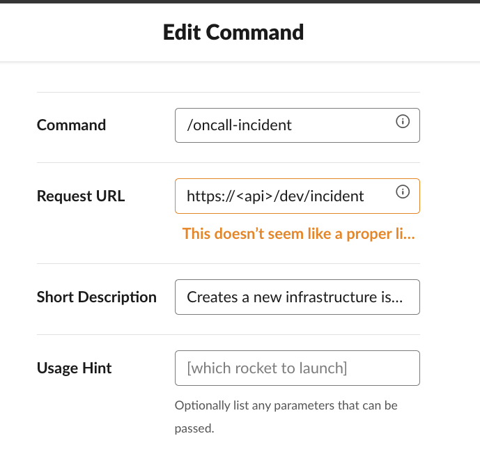
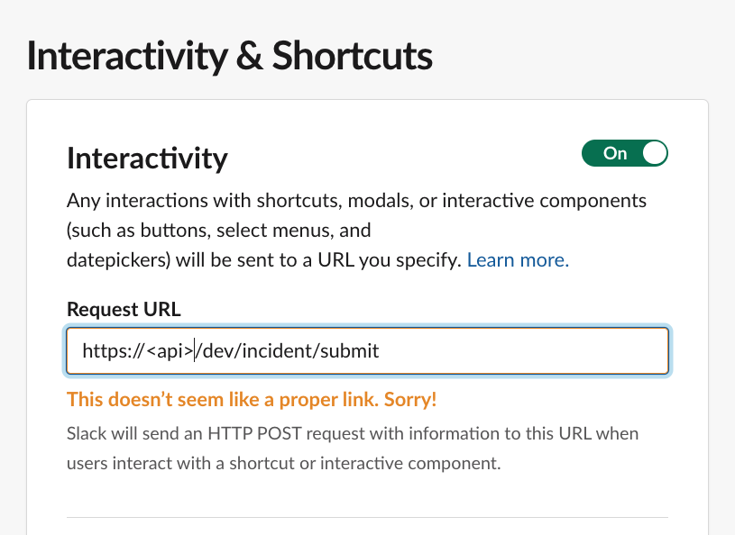
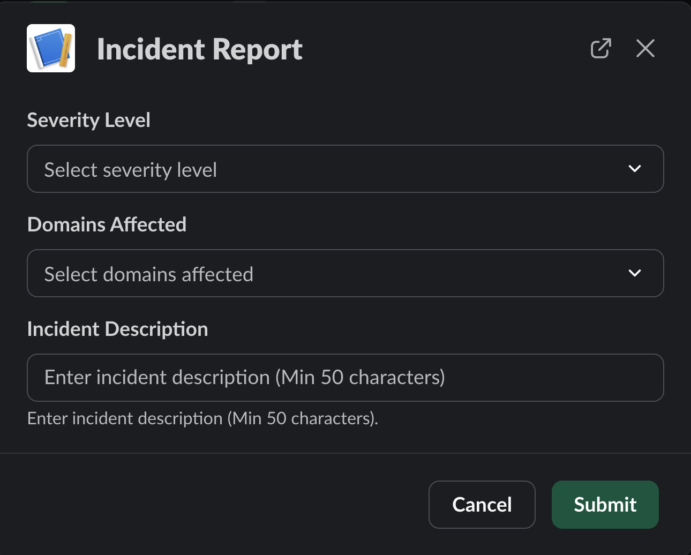
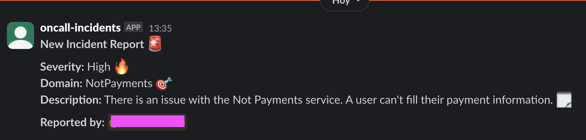
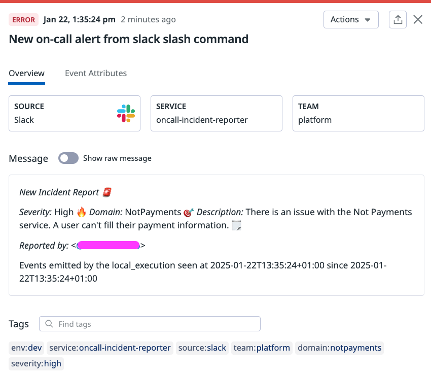

# Setting Up a Slack Command Integration

This guide walks you through integrating your application with Slack, allowing you to create and use custom Slack commands.

> **Prerequisites:**
> - Your API Gateway and Lambda function should already be deployed
> - For infrastructure deployment details, see [terraform deployment documentation](./terraform_deployment.md)

## 1. Creating Your Slack App

1. Create a new Slack app by following the [Slack API Quick Start Guide](https://api.slack.com/quickstart)
2. **Important:** Enable the `chat:write` scope if you want your app to send messages
3. Install the app to your Slack workspace

## 2. Configuring Slash Commands

### Setting up the Command Endpoint
1. Navigate to your Slack app's configuration page
2. Go to **Features** → **Slash Commands**
3. Click the pencil icon to create/edit a command
4. Configure the following:
   - Choose your command name (e.g., `/oncall-incident`)
   - Set the Request URL: `https://<your-api-gateway-url>/<config.endpoints.slack_command>`
5. Save your changes

### Setting up Interactivity
1. Go to **Features** → **Interactivity & Shortcuts**
2. Set the Request URL: `https://<your-api-gateway-url>/<config.endpoints.slack_modal_parser>`
3. Save your changes

## 3. Configuring Authentication

You'll need two authentication values from your Slack app:

1. **Bot User OAuth Token** (`SLACK_TOKEN`)
   - Found under **Settings** → **Install App**
   - Set this as your `SLACK_TOKEN` environment variable

2. **Signing Secret** (`SLACK_SIGNING_SECRET`)
   - Found under **Settings** → **Basic Information**
   - Set this as your `SLACK_SIGNING_SECRET` environment variable

## 4. Testing Your Integration

Once configured, you can test your integration:

1. Type your slash command in Slack
2. A modal will appear (customizable via `config.yaml`)
3. Fill in the required information and submit

### Example Workflow

1. **Command Execution:**
   

2. **Response Message** (appears for high-severity incidents):
   

3. **Datadog Integration:**
   - Events appear in Datadog dashboard
   - Configured monitors trigger for critical states
   
